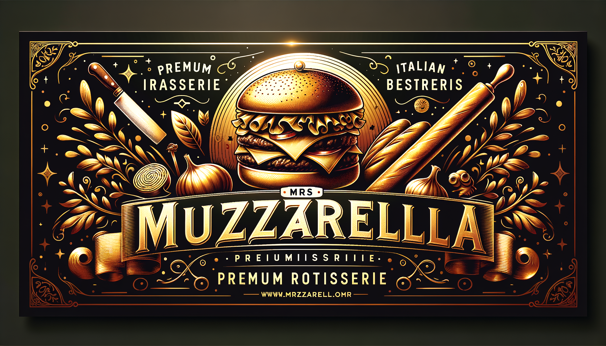

<p align="center">
  <picture>
    <source media="(prefers-color-scheme: dark)" srcset="./public/assets/images/banner-readme.png">
    
  </picture>
</p>

<p align="center">
  <strong>Sistema de gestión integral para rotisería premium</strong><br>
  <em>WhatsApp Agent · Panel Admin · Telegram Bot · Meta Ads · Analytics</em>
</p>

<p align="center">
  <a href="#-características"></a>
  <a href="#-stack"></a>
  <a href="#-deploy"></a>
  <a href="LICENSE"></a>
</p>

---

## 📋 Tabla de Contenidos

- [Visión General](#-visión-general)
- [Características](#-características)
- [Stack Tecnológico](#-stack)
- [Arquitectura](#-arquitectura)
- [Primeros Pasos](#-primeros-pasos)
- [Scripts Disponibles](#-scripts)
- [Estructura del Proyecto](#-estructura)
- [Variables de Entorno](#-variables-de-entorno)
- [Deploy](#-deploy)
- [Contribuir](#-contribuir)
- [Licencia](#-licencia)

---

## 🎯 Visión General

**Mrs Muzzarella** es un sistema de gestión integral construido para una rotisería premium en Formosa, Argentina. Combina un **agente de WhatsApp con IA**, un **panel de administración completo**, un **bot de Telegram** y **analytics** para ofrecer una solución 360° de ventas, atención al cliente y operaciones.

El sistema maneja dos líneas de negocio:

| Línea | Público | Enfoque |
|-------|---------|---------|
| 🍔 **Hamburguesas** | Consumidor final (B2C) | Ventas, promos, delivery |
| 🍞 **Pan al por mayor** | Comercios (B2B) | Pedidos mayoristas, cuentas |

> **Autor:** [Fusa Labs](https://github.com/fusalabs) · Código abierto (MIT)

---

## ✨ Características

### 🤖 Agente WhatsApp con IA

- **Procesamiento inteligente** de mensajes vía OpenAI GPT-4o-mini
- **Detección emocional** con 7 flujos de conversación (F1-F7)
- **Buffer de 16 segundos** para agregar mensajes entrantes
- **Herramientas contextuales**: horarios, menú, disponibilidad, toma de pedidos
- **Inyección de prompt segura** con detección de injection
- **Configuración vía admin**: system prompt, horarios, contexto adicional

### 📊 Panel de Administración

- **Dashboard** con métricas en tiempo real
- **Productos**: CRUD completo, toggle pollo/carne, coming soon
- **Pedidos / Cocina**: visualización por estado (pendiente → preparando → listo → entregado)
- **Clientes**: vista unificada con pedidos, conversaciones y leads
- **Conversaciones**: historial completo con filtros
- **Leads**: gestión con pipeline de conversión
- **Analytics**: estadísticas y gráficos

### 📱 Integraciones

- **WhatsApp Business API** vía YCloud
- **Meta Ads** (Pixel + Conversion API)
- **Telegram Bot** para administración remota
- **Facebook Login** (NextAuth)
- **Atribución UTM** con códigos de referido

### 🏗️ Infraestructura Profesional

- **Rate Limiting** con @upstash/ratelimit (20 msg/min por usuario, 100 global)
- **Redis Queue** con producer (LPUSH) + worker (RPOP + retry exponencial)
- **Dead Letter Queue** con API de administración
- **Circuit Breaker** para OpenAI (5 errores → 60s cooldown)
- **Idempotency** para evitar duplicados
- **Structured Logging** con pino + correlation ID
- **Middleware de auth** con NextAuth v5

---

## 🛠 Stack

| Capa | Tecnología |
|------|-----------|
| **Framework** | [Next.js 16](https://nextjs.org/) (App Router) |
| **UI** | [React 19](https://react.dev/) · [shadcn/ui](https://ui.shadcn.com/) · [Framer Motion](https://www.framer.com/motion/) |
| **Estilos** | [Tailwind CSS 4](https://tailwindcss.com/) · [Lucide Icons](https://lucide.dev/) |
| **Backend** | [Next.js API Routes](https://nextjs.org/docs/app/building-your-application/routing/route-handlers) · Server Actions |
| **Base de Datos** | [Neon PostgreSQL](https://neon.tech/) · [Drizzle ORM](https://orm.drizzle.team/) |
| **Autenticación** | [NextAuth v5](https://next-auth.js.org/) (Credentials + Facebook) |
| **AI / LLM** | [OpenAI](https://openai.com/) (GPT-4o-mini) · [AI SDK](https://sdk.vercel.ai/) |
| **WhatsApp** | [YCloud API](https://ycloud.com/) |
| **Caché / Queue** | [Upstash Redis](https://upstash.com/) |
| **Logging** | [pino](https://getpino.io/) |
| **Validador** | [Zod](https://zod.dev/) |
| **Deploy** | [Render](https://render.com/) |

---

## 🏛 Arquitectura

```
┌─────────────────────────────────────────────────────────┐
│                     Clientes                             │
│  ┌──────────┐  ┌──────────┐  ┌──────────┐  ┌─────────┐ │
│  │ WhatsApp │  │ Telegram │  │  Admin   │  │  Meta   │ │
│  │  (User)  │  │  (User)  │  │   Web    │  │  Ads    │ │
│  └────┬─────┘  └────┬─────┘  └────┬─────┘  └────┬────┘ │
└───────┼──────────────┼──────────────┼──────────────┼──────┘
        │              │              │              │
┌───────┼──────────────┼──────────────┼──────────────┼──────┐
│       ▼              ▼              ▼              ▼      │
│  ┌──────────┐  ┌──────────┐  ┌──────────┐  ┌──────────┐ │
│  │ Webhook  │  │ Webhook  │  │  Admin   │  │   Meta   │ │
│  │ WhatsApp │  │ Telegram │  │  Routes  │  │ Webhooks │ │
│  └────┬─────┘  └────┬─────┘  └────┬─────┘  └────┬─────┘ │
│       │              │              │              │      │
│  ┌────▼──────────────▼──────────────▼──────────────▼──┐  │
│  │              Next.js App Router                     │  │
│  │  ┌─────────────┐  ┌─────────────┐                   │  │
│  │  │ Server      │  │ API Routes  │                   │  │
│  │  │ Components  │  │ + Actions   │                   │  │
│  │  └─────────────┘  └──────┬──────┘                   │  │
│  └──────────────────────────┼──────────────────────────┘  │
│                             │                             │
│              ┌──────────────▼──────────────┐              │
│              │       AI Agent Layer         │              │
│              │  ┌────────┐ ┌─────────────┐ │              │
│              │  │ Agent  │ │ WhatsApp    │ │              │
│              │  │ Simple │ │ Agent V2    │ │              │
│              │  └───┬────┘ └──────┬──────┘ │              │
│              └──────┼─────────────┼────────┘              │
│                     │             │                       │
│              ┌──────▼─────────────▼────────┐              │
│              │     OpenAI (GPT-4o-mini)     │              │
│              └─────────────────────────────┘              │
│                             │                             │
│              ┌──────────────▼──────────────┐              │
│              │      Infra Layer            │              │
│              │  ┌──────────┐ ┌──────────┐  │              │
│              │  │ Rate     │ │ Redis    │  │              │
│              │  │ Limiting │ │ Queue    │  │              │
│              │  ├──────────┤ ├──────────┤  │              │
│              │  │ Circuit  │ │ DLQ      │  │              │
│              │  │ Breaker  │ │          │  │              │
│              │  └──────────┘ └──────────┘  │              │
│              └──────────────┬──────────────┘              │
│                             │                             │
│              ┌──────────────▼──────────────┐              │
│              │     Drizzle ORM + Neon      │              │
│              │  ┌──────┐ ┌──────┐ ┌──────┐ │              │
│              │  │Users │ │Orders│ │Leads │ │              │
│              │  ├──────┤ ├──────┤ ├──────┤ │              │
│              │  │Prods │ │Agent │ │Convs │ │              │
│              │  └──────┘ └──────┘ └──────┘ │              │
│              └─────────────────────────────┘              │
└──────────────────────────────────────────────────────────┘
```

---

## 🚀 Primeros Pasos

### Prerrequisitos

- **Node.js** 20+
- **npm** 10+
- **PostgreSQL** (o cuenta en [Neon](https://neon.tech/))
- **Cuenta en YCloud** (para WhatsApp API)
- **API Key de OpenAI**
- **Cuenta en Upstash** (para Redis — opcional, fallback in-memory)

### Instalación

```bash
# Clonar el repositorio
git clone https://github.com/fusalabs/muzapp.git
cd muzapp

# Instalar dependencias
npm install

# Copiar variables de entorno
cp .env.example .env.local
# Editar .env.local con tus credenciales

# Inicializar la base de datos
npm run db:push

# Sembrar datos iniciales
npm run db:seed

# Iniciar en desarrollo
npm run dev
```

### Configuración Rápida

```bash
# 1. Crear cuenta en Neon y obtener DATABASE_URL
# 2. Generar AUTH_SECRET:
openssl rand -base64 32

# 3. Configurar YCloud:
#    - Crear cuenta en ycloud.com
#    - Obtener API Key
#    - Configurar webhook → /api/webhook/whatsapp

# 4. Configurar OpenAI:
#    - Obtener API Key en platform.openai.com

# 5. (Opcional) Configurar Upstash Redis:
#    - Crear base de datos Redis en upstash.com
#    - Agregar UPSTASH_REDIS_REST_URL y UPSTASH_REDIS_REST_TOKEN
```

---

## 📜 Scripts

| Comando | Descripción |
|---------|-------------|
| `npm run dev` | Inicia servidor de desarrollo (Next.js 16) |
| `npm run build` | Build de producción |
| `npm start` | Inicia servidor de producción |
| `npm run lint` | ESLint |
| `npm run db:push` | Pushea schema a DB (Drizzle) |
| `npm run db:generate` | Genera migraciones |
| `npm run db:migrate` | Corre migraciones |
| `npm run db:seed` | Siembra datos iniciales |
| `npm run db:studio` | Abre Drizzle Studio |

---

## 📁 Estructura

```
muzapp/
├── src/
│   ├── app/
│   │   ├── (admin)/              # Panel admin (protegido)
│   │   │   └── admin/
│   │   │       ├── agent/        # Config agente IA
│   │   │       ├── clients/      # Clientes unificados
│   │   │       ├── conversations/ # Conversaciones WhatsApp
│   │   │       ├── leads/        # Leads pipeline
│   │   │       ├── meta/         # Config Meta Ads
│   │   │       ├── orders/       # Pedidos / Cocina
│   │   │       ├── products/     # Gestión de productos
│   │   │       └── analytics/    # Estadísticas
│   │   ├── (storefront)/         # Frontend público
│   │   │   ├── hamburguesas/     # Catálogo B2C
│   │   │   └── pan-mayorista/    # Catálogo B2B
│   │   ├── api/                  # API Routes
│   │   │   ├── webhook/whatsapp/ # Webhook YCloud
│   │   │   ├── whatsapp/         # Endpoints WhatsApp
│   │   │   ├── telegram/         # Webhook Telegram
│   │   │   ├── admin/dlq/        # Dead Letter Queue
│   │   │   ├── auth/             # NextAuth handlers
│   │   │   ├── leads/            # API leads
│   │   │   └── products/         # API productos
│   │   └── login/                # Login page
│   ├── auth/                     # NextAuth config
│   ├── components/
│   │   ├── admin/                # Sidebar, Topbar, Nav
│   │   ├── ui/                   # shadcn/ui components
│   │   ├── products/             # Product cards, grids
│   │   ├── meta/                 # Meta Ads components
│   │   └── ...                   # Feature components
│   ├── db/
│   │   ├── schema.ts             # Drizzle schema (7 tablas)
│   │   ├── index.ts              # DB connection
│   │   └── seed.ts               # Seed data
│   ├── lib/
│   │   ├── agent/                # AI Agent (simple)
│   │   ├── whatsapp/             # WhatsApp Agent V2 + tools
│   │   ├── telegram/             # Telegram bot handlers
│   │   ├── queue/                # Redis queue system
│   │   ├── infra/                # Rate limit, circuit breaker
│   │   ├── meta/                 # Meta Ads config
│   │   ├── analytics/            # Analytics queries
│   │   └── attribution/          # UTM / referidos
│   └── auth/                     # NextAuth providers
├── public/
│   └── assets/images/            # Imágenes del proyecto
├── drizzle.config.ts
├── next.config.ts
├── tailwind.config.ts
└── tsconfig.json
```

---

## 🔐 Variables de Entorno

```
# Database + Auth
DATABASE_URL=postgresql://...
AUTH_SECRET=tu-secret
AUTH_URL=https://muzzarella.onrender.com

# WhatsApp Agent (YCloud)
YCLOUD_API_KEY=tu-api-key
YCLOUD_WEBHOOK_SECRET=tu-webhook-secret
WHATSAPP_PHONE_NUMBER=5491112345678

# AI
OPENAI_API_KEY=sk-tu-openai-api-key

# Telegram Bot
TELEGRAM_BOT_TOKEN=tu-bot-token
TELEGRAM_WEBHOOK_TOKEN=muzapp-telegram-secret

# Meta Ads
META_APP_ID=tu-meta-app-id
META_APP_SECRET=tu-meta-app-secret
NEXT_PUBLIC_META_PIXEL_ID=tu-pixel-id

# Facebook Login
FACEBOOK_CLIENT_ID=tu-facebook-app-id
FACEBOOK_CLIENT_SECRET=tu-facebook-app-secret

# Redis (Upstash — opcional)
UPSTASH_REDIS_REST_URL=https://...
UPSTASH_REDIS_REST_TOKEN=...
```

> 📄 Ver `.env.example` para la lista completa con descripciones.

---

## 🌐 Deploy

### Render (recomendado)

```yaml
# render.yaml
services:
  - type: web
    name: muzapp
    env: node
    buildCommand: npm install && npm run build
    startCommand: npm start
    envVars:
      - key: NODE_VERSION
        value: "20"
      - key: NPM_CONFIG_PRODUCTION
        value: "false"
```

**Pasos:**
1. Conectá tu repositorio de GitHub
2. Configurá las variables de entorno en el dashboard de Render
3. Configurá el webhook de YCloud apuntando a `https://tuapp.onrender.com/api/webhook/whatsapp`
4. Configurá el webhook de Telegram apuntando a `https://tuapp.onrender.com/api/telegram/webhook/{token}`

### Base de Datos

Usá [Neon](https://neon.tech/) para PostgreSQL serverless. Creá un proyecto, obtené laconnection string y agregala como `DATABASE_URL`.

### Redis (Opcional)

Creá una base de datos en [Upstash](https://upstash.com/). Sin Redis configurado, el sistema funciona en modo fallback in-memory.

---

## 🤝 Contribuir

Las contribuciones son bienvenidas. Este es un proyecto open source de **Fusa Labs**.

1. Forkeá el repo
2. Creá tu branch (`git checkout -b feat/feature-name`)
3. Commit con [Conventional Commits](https://www.conventionalcommits.org/)
4. Push a tu branch (`git push origin feat/feature-name`)
5. Abrí un Pull Request

### Convenciones

- **Commits**: `feat:`, `fix:`, `chore:`, `refactor:`, `docs:`
- **Branches**: `feat/`, `fix/`, `chore/`
- **Código**: TypeScript estricto, server components por defecto
- **UI**: shadcn/ui + Tailwind CSS + framer-motion

---

## 📄 Licencia

MIT © [Fusa Labs](https://github.com/fusalabs)

---

<p align="center">
  <sub>Hecho con ❤️ en Formosa, Argentina · </sub>
  <a href="https://instagram.com/mrsmuzzarella"><sub>@mrsmuzzarella</sub></a>
</p>
