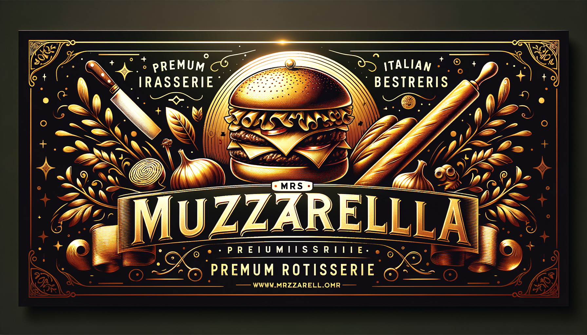

<p align="center">
  <picture>
    <source media="(prefers-color-scheme: dark)" srcset="./public/assets/images/banner-readme.png">
    
  </picture>
</p>

<p align="center">
  <strong>AI-powered platform for food businesses</strong><br>
  <em>WhatsApp Agent · Admin Dashboard · Telegram Bot · Meta Ads · Analytics</em>
</p>

<p align="center">
  <a href="#-features"></a>
  <a href="#-tech-stack"></a>
  <a href="#-quick-deploy"></a>
  <a href="#-for-every-food-business"></a>
  <a href="LICENSE"></a>
  <a href="https://github.com/fusalabs/muzapp/stargazers"></a>
</p>

---

## 📋 Table of Contents

- [What is Muzapp?](#-what-is-muzapp)
- [Features](#-features)
- [For Every Food Business](#-for-every-food-business)
- [Tech Stack](#-tech-stack)
- [Architecture](#-architecture)
- [Getting Started](#-getting-started)
- [Adapting to Your Business](#-adapting-to-your-business)
- [Business Configuration](#-business-configuration)
- [Scripts](#-scripts)
- [Project Structure](#-project-structure)
- [Environment Variables](#-environment-variables)
- [Quick Deploy](#-quick-deploy)
- [Contributing](#-contributing)
- [License](#-license)

---

## 🎯 What is Muzapp?

Muzapp is a **complete operational platform** for food businesses — pizzerias, burger joints, bakeries, rotiserias, or any food service that wants to:

- ✅ Automate WhatsApp sales with an AI agent
- ✅ Coordinate kitchen, delivery, and management in real time
- ✅ Replace paper notes and scattered WhatsApp messages
- ✅ Get analytics and insights without spreadsheets
- ✅ Offer a professional online storefront

Built for **Mrs Muzzarella** (a premium rotisería in Formosa, Argentina), but designed to be **replicated and adapted** to any food business. Change the prompts, products, branding — and it's yours.

> **Two lines of business supported out of the box:**
> - 🍔 **B2C** — direct consumer sales (burgers, pizza, empanadas, etc.)
> - 🍞 **B2B** — wholesale (bread, ingredients, bulk orders)

---

## ✨ Features

### 🤖 WhatsApp AI Agent (Karen)

| Feature | Description |
|---------|-------------|
| **Smart conversations** | OpenAI GPT-5-mini with 27+ tools |
| **Emotional detection** | 7 conversation flows (urgency, doubt, price sensitivity) |
| **Order memory** | Persistent context with 30min TTL per conversation |
| **Photo menu** | Sends menu images, product photos, stickers |
| **Dead-end recovery** | Auto-retry when agent stalls |
| **Secure** | Prompt injection detection, HMAC webhook verification |
| **Human override** | One-click take control, 24h auto-return |
| **Scheduled tasks** | Program follow-ups, upsells, delivery notifications |

### 📊 Admin Dashboard

| Section | What you can do |
|---------|-----------------|
| **Dashboard** | Real-time metrics, recent activity feed |
| **Products** | Full CRUD, categories, lines, variants, availability toggles |
| **Orders / Kitchen** | Card-based order view, status progression, auto-WhatsApp on each change |
| **Agent Config** | Full AI agent control: prompts, hours, stock, payment aliases, delivery zones |
| **Telegram Bot** | Configure bot token, webhook, allowed chats |
| **Meta Ads** | Pixel + Conversion API integration, OAuth setup |
| **Conversations** | Full inbox with human override, customer context panel |
| **Clients** | Unified view of customers with orders, conversations, tags |
| **Leads** | Pipeline with UTM attribution, campaign tracking |
| **Analytics** | Charts, top products, top clients, average ticket, campaign performance |

### 📱 Multi-Channel

- **WhatsApp** — YCloud Business API with HMAC signature verification
- **Telegram** — Internal bot for management (35+ tools)
- **Web** — Public storefront for online orders
- **Admin Panel** — Full dashboard for operations

### 🏗️ Production Infrastructure

- **Rate limiting** — 20 req/min per user, 100 global (Upstash)
- **Message buffer** — 60s sliding window debounce for WhatsApp
- **Redis queue** — Producer/consumer with exponential backoff
- **Dead Letter Queue** — Failed message inspection and replay
- **Circuit Breaker** — OpenAI protection (5 errors → 60s cooldown)
- **Idempotency** — Duplicate message prevention at DB and content level
- **Structured logging** — Pino with correlation IDs
- **Echo detection** — Handles human replies from WhatsApp Business App

---

## 🔄 For Every Food Business

Muzapp is **open source and replicable**. Built for one business, designed for any business.

### What you need to adapt

| Component | What to change | Where |
|-----------|---------------|-------|
| **Agent identity** | Karen's name, tone, language | Admin Panel → Agent IA → System Prompt |
| **Products** | Your menu, categories, prices | Admin Panel → Products |
| **Business hours** | Schedule, holidays | Admin Panel → Agent IA → Horarios |
| **Payment info** | Aliases, bank accounts | Admin Panel → Agent IA → Alias de pago |
| **Delivery zones** | Coverage areas, costs, times | Admin Panel → Agent IA → Zonas de delivery |
| **Promotions** | Active deals, combos | Admin Panel → Agent IA → Promociones |
| **Branding** | Name, logo, colors | `public/assets/images/` + Tailwind config |
| **Images** | Menu photos, product photos | Admin Panel → Agent IA → Imágenes de Menú |
| **Telegram bot** | Name, token, allowed chats | Admin Panel → Telegram Bot |
| **WhatsApp number** | Business phone | Admin Panel → Agent IA → Configuración general |
| **Storefront text** | Business description, about | Storefront components in `src/app/(storefront)/` |

### Use cases this supports

| Business type | Adaptable? | What changes |
|--------------|------------|--------------|
| 🍕 Pizzeria | ✅ Fully | Products, agent prompt, delivery zones |
| 🍔 Burger joint | ✅ Fully | Products, agent prompt (same as Mrs Muzzarella base) |
| 🥟 Empanada shop | ✅ Fully | Products, categories, agent prompt |
| 🥐 Bakery | ✅ Fully | B2B wholesale model, products |
| 🥗 Healthy food | ✅ Fully | Products, categories, agent prompt |
| 🍱 Rotisería | ✅ Fully | Products, categories, agent prompt |
| 🧁 Coffee shop | ✅ Fully | Products, categories, storefront |
| 🍦 Ice cream shop | ✅ Fully | Products, categories, storefront |

### The AI Agent adapts to YOU

Change one line in the system prompt and Karen becomes whoever you need:

```
Before (Mrs Muzzarella):
  "Te llamás Karen, atendés el WhatsApp de Mrs Muzzarella (Formosa).
   Vendés hamburguesas, pan mayorista, tragos V.I.P."

After (Your business):
  "Te llamás Luca, atendés el WhatsApp de Pizzería Napoli (Buenos Aires).
   Vendés pizzas, empanadas, fainá, bebidas."
```

The entire sales flow, order memory, delivery coordination, and follow-ups work the same.

---

## 🛠 Tech Stack

| Layer | Technology |
|-------|-----------|
| **Framework** | [Next.js 16](https://nextjs.org/) (App Router) |
| **UI** | [React 19](https://react.dev/) · [shadcn/ui](https://ui.shadcn.com/) · [Framer Motion](https://www.framer.com/motion/) |
| **Styles** | [Tailwind CSS 4](https://tailwindcss.com/) · [Lucide Icons](https://lucide.dev/) |
| **Backend** | [Next.js API Routes](https://nextjs.org/docs/app/building-your-application/routing/route-handlers) · Server Actions |
| **Database** | [Neon PostgreSQL](https://neon.tech/) · [Drizzle ORM](https://orm.drizzle.team/) |
| **Auth** | [NextAuth v5](https://next-auth.js.org/) (Credentials + Facebook) |
| **AI / LLM** | [OpenAI](https://openai.com/) (GPT-4o-mini · GPT-5-mini) · [AI SDK](https://sdk.vercel.ai/) |
| **WhatsApp** | [YCloud API](https://ycloud.com/) |
| **Cache / Queue** | [Upstash Redis](https://upstash.com/) (optional, in-memory fallback) |
| **Media** | [Cloudinary](https://cloudinary.com/) (image uploads) |
| **Audio** | OpenAI Whisper (transcription) |
| **Vision** | OpenAI GPT-4 Vision (image analysis) |
| **Logging** | [pino](https://getpino.io/) |
| **Validation** | [Zod](https://zod.dev/) |
| **Deploy** | [Render](https://render.com/) |

---

## 🏛 Architecture

```
                              ┌─────────────────────────────┐
                              │      EXTERNAL CLIENTS        │
                              │  ┌─────┐ ┌──────┐ ┌──────┐  │
                              │  │ WA  │ │ TG   │ │ Web  │  │
                              │  │Users│ │Users │ │Users │  │
                              │  └──┬──┘ └──┬───┘ └──┬───┘  │
                              └─────┼───────┼────────┼──────┘
                                    │       │        │
┌───────────────────────────────────┼───────┼────────┼──────────────┐
│                    NEXT.JS APP ROUTER          │                  │
│                                   │       │        │              │
│  ┌──────────────┐  ┌──────────────▼───────▼────────▼─────────┐   │
│  │  Public      │  │          API LAYER                      │   │
│  │  Storefront  │  │  ┌──────────┐ ┌──────────┐ ┌─────────┐  │   │
│  │  /hamburguesas│  │  │ WhatsApp │ │ Telegram │ │  Meta   │  │   │
│  │  /pan-mayorist│  │  │ Webhook  │ │ Webhook  │ │Webhooks │  │   │
│  └──────────────┘  │  └────┬─────┘ └────┬─────┘ └────┬────┘  │   │
│                    │       │             │             │       │   │
│  ┌──────────────┐  │  ┌────▼─────────────▼─────────────▼───┐   │   │
│  │  Admin Panel  │  │  │     AI AGENT LAYER                │   │   │
│  │  /admin/*     │  │  │  ┌──────────┐  ┌──────────────┐  │   │   │
│  │  (Protected)   │  │  │  │WhatsApp │  │  Telegram    │  │   │   │
│  │               │  │  │  │ Agent   │  │  Internal    │  │   │   │
│  └──────────────┘  │  │  │ (Karen) │  │  Bot (Admin) │  │   │   │
│                    │  │  │ 27 tools │  │  37 tools    │  │   │   │
│                    │  │  └────┬─────┘  └──────┬───────┘  │   │   │
│                    │  └───────┼────────────────┼──────────┘   │   │
│                    │          │                │              │   │
│                    │  ┌───────▼────────────────▼──────────┐   │   │
│                    │  │         OPENAI (GPT-4o-mini)       │   │   │
│                    │  │  + Whisper + Vision                │   │   │
│                    │  └────────────────────────────────────┘   │   │
│                    │                                           │   │
│                    │  ┌─────────────────────────────────────┐  │   │
│                    │  │      INFRASTRUCTURE LAYER            │  │   │
│                    │  │  ┌─────────┐ ┌──────────┐ ┌──────┐  │  │   │
│                    │  │  │ Rate    │ │  Redis   │ │Circuit│  │  │   │
│                    │  │  │ Limiter │ │  Queue   │ │Breaker│  │  │   │
│                    │  │  ├─────────┤ ├──────────┤ ├──────┤  │  │   │
│                    │  │  │Idempo-  │ │   DLQ    │ │Buffer│  │  │   │
│                    │  │  │tency    │ │          │ │System│  │  │   │
│                    │  │  └─────────┘ └──────────┘ └──────┘  │  │   │
│                    │  └─────────────────────────────────────┘  │   │
│                    │                                           │   │
│                    │  ┌─────────────────────────────────────┐  │   │
│                    │  │   DRIZZLE ORM + NEON POSTGRESQL      │  │   │
│                    │  │  ┌──────┐ ┌──────┐ ┌──────┐ ┌────┐ │  │   │
│                    │  │  │Users │ │Orders│ │Leads │ │Prods│ │  │   │
│                    │  │  ├──────┤ ├──────┤ ├──────┤ ├────┤ │  │   │
│                    │  │  │Convs │ │Agent │ │Addr  │ │Atts│ │  │   │
│                    │  │  └──────┘ └──────┘ └──────┘ └────┘ │  │   │
│                    │  └─────────────────────────────────────┘  │   │
│                    └──────────────────────────────────────────┘   │
└───────────────────────────────────────────────────────────────────┘
```

---

## 🚀 Getting Started

### Prerequisites

| Requirement | Details | Cost |
|-------------|---------|------|
| **Node.js 20+** | Runtime | Free |
| **PostgreSQL** | [Neon](https://neon.tech/) (serverless, free tier) | Free tier |
| **OpenAI API Key** | [platform.openai.com](https://platform.openai.com/) | Pay-per-use (~$20-50/mo for small business) |
| **YCloud Account** | [ycloud.com](https://ycloud.com/) for WhatsApp API | Free tier available |
| **WhatsApp Business** | Meta-verified phone number | Free |
| **Cloudinary** | [cloudinary.com](https://cloudinary.com/) for images | Free tier |
| **Upstash Redis** | [upstash.com](https://upstash.com/) (optional) | Free tier |
| **Render Account** | [render.com](https://render.com/) for hosting | Free tier (sleeps after inactivity) |

### Installation

```bash
# Clone
git clone https://github.com/fusalabs/muzapp.git
cd muzapp

# Install dependencies
npm install

# Environment setup
cp .env.example .env.local
# Edit .env.local with your credentials (see Environment Variables section)

# Database setup
npm run db:push    # Push schema to PostgreSQL
npm run db:seed    # Seed initial data (admin user + sample products)

# Start development
npm run dev        # Opens at http://localhost:3000
```

### First-time Configuration

```bash
# 1. Generate AUTH_SECRET
openssl rand -base64 32

# 2. Login to admin panel
#    → http://localhost:3000/login
#    → admin@mrsmuzzarella.com / changeme123

# 3. Go to Admin Panel → Agente IA → configure:
#    - WhatsApp number (YCloud)
#    - Business hours
#    - Your products
#    - Delivery zones
#    - Payment aliases

# 4. Go to Admin Panel → Telegram Bot → set up your bot token

# 5. Go to Admin Panel → Products → update menu with YOUR products
```

---

## 🔧 Adapting to Your Business

### 1. Fork the Repository

```bash
# On GitHub, click "Fork" or use gh CLI:
gh repo fork fusalabs/muzapp --clone
```

### 2. Change the AI Agent Personality

Go to **Admin Panel → Agente IA → Editor de Prompt** and change:

```
Before (default for Mrs Muzzarella):
  "Te llamás Karen, atendés el WhatsApp de Mrs Muzzarella (Formosa)..."

After (for your business, e.g., Pizzería Napoli):
  "Te llamás Luca, atendés el WhatsApp de Pizzería Napoli (Buenos Aires).
   Vendés pizzas, empanadas, fainá, bebidas..."
```

Or replace the entire default prompt in:
- `src/lib/whatsapp/prompt-builder.ts` (the `DEFAULT_SYSTEM_PROMPT` constant)

### 3. Update Products

Delete the seed products and add yours via:
- **Admin Panel → Products** — full CRUD with categories, prices, images
- Or edit `src/db/seed.ts` and re-run `npm run db:seed`

### 4. Configure Your Business

| Setting | Where to change |
|---------|-----------------|
| Business name | `public/assets/images/banner-readme.png` + Storefront |
| Business hours | Admin Panel → Agente IA → Horarios |
| Delivery zones | Admin Panel → Agente IA → Zonas de delivery |
| Payment info | Admin Panel → Agente IA → Alias de pago |
| Promotions | Admin Panel → Agente IA → Promociones activas |
| Menu photos | Admin Panel → Agente IA → Imágenes de Menú |
| WhatsApp number | Admin Panel → Agente IA → Configuración general |
| Telegram bot | Admin Panel → Telegram Bot |
| Meta Ads | Admin Panel → Meta Ads |

### 5. Customize the System Prompt (Advanced)

For deeper customization, modify the WhatsApp agent's core prompt:

**`src/lib/whatsapp/prompt-builder.ts`** — `DEFAULT_SYSTEM_PROMPT` (V4):
- Agent identity and name
- Sales flow steps
- Tone and language
- Product categories
- Business-specific rules

**`src/lib/telegram/system-prompt.ts`** — `INTERNAL_AGENT_SYSTEM_PROMPT`:
- Admin bot identity
- Available management capabilities
- Example commands

### 6. Customize the Storefront

Edit the public-facing pages in `src/app/(storefront)/`:
- `hamburguesas/` → change to your product categories
- `pan-mayorista/` → change to your B2B offering

### 7. Change Branding

- **Logo/Images**: Replace `public/assets/images/`
- **Colors**: Edit `tailwind.config.ts` and CSS variables
- **Name**: Update page titles, meta tags, footer

---

## 💼 Business Configuration

All configuration is done through the **Admin Panel** (no code changes needed):

```
Admin Panel → Agente IA
├── Estado del agente (on/off)
├── Configuración general
│   ├── WhatsApp number
│   └── System prompt
├── Credenciales YCloud
│   ├── API Key
│   └── Bot number
├── IDs permitidos (who can talk to the bot)
├── Horarios de atención (per day)
├── Ventana 24h (auto-reply)
├── Entrenar bot (extra context)
├── Editor de Prompt
│   ├── Custom system prompt
│   ├── Instructions
│   ├── Promociones
│   └── Delivery zones
├── Estado del Local
│   ├── Cocina operativa toggle
│   ├── Stock (docenas para pan)
│   ├── Alias de pago B2C/B2B
│   └── Tiempo de espera
├── Imágenes de Menú
└── Delivery phone number
```

---

## 📜 Scripts

| Command | Description |
|---------|-------------|
| `npm run dev` | Start development server |
| `npm run build` | Production build |
| `npm start` | Start production server |
| `npm run lint` | ESLint check |
| `npm run db:push` | Push Drizzle schema to DB |
| `npm run db:generate` | Generate migrations |
| `npm run db:migrate` | Run migrations |
| `npm run db:seed` | Seed initial data |
| `npm run db:studio` | Open Drizzle Studio |

---

## 📁 Project Structure

```
muzapp/
├── src/
│   ├── app/
│   │   ├── (admin)/admin/          # Admin panel (protected routes)
│   │   │   ├── agent/              # AI Agent configuration
│   │   │   ├── clients/            # Unified customer view
│   │   │   ├── conversations/      # WhatsApp inbox + human override
│   │   │   ├── leads/              # Lead pipeline with UTM
│   │   │   ├── meta/               # Meta Ads integration
│   │   │   ├── orders/             # Kitchen orders + status flow
│   │   │   ├── products/           # Product management
│   │   │   ├── telegram/           # Telegram bot config
│   │   │   └── analytics/          # Stats and charts
│   │   ├── (storefront)/           # Public product pages
│   │   ├── api/                    # API routes + webhooks
│   │   └── login/                  # Authentication page
│   ├── auth/                       # NextAuth configuration
│   ├── components/                 # Reusable UI components
│   │   ├── admin/                  # Sidebar, topbar, nav
│   │   ├── ui/                     # shadcn/ui primitives
│   │   ├── orders/                 # Order cards, modals
│   │   ├── messages/               # Chat panel, conversation components
│   │   └── analytics/              # Charts and stats widgets
│   ├── db/
│   │   ├── schema.ts               # Complete Drizzle schema (10 tables)
│   │   ├── index.ts                # Database connection (Neon)
│   │   └── seed.ts                 # Initial data seeder
│   └── lib/
│       ├── whatsapp/               # WhatsApp agent (Karen) + 27 tools
│       ├── telegram/               # Telegram bot + 37 tools
│       ├── channels/               # Unified channel router
│       ├── buffer/                 # Message buffer (60s debounce)
│       ├── queue/                  # Redis queue system
│       ├── infra/                  # Rate limiting, circuit breaker
│       ├── media/                  # Audio transcription, vision analysis
│       └── ...                     # Addresses, order context, ycloud, etc.
├── public/assets/images/           # Brand images, banners
├── docs/                           # Documentation and manuals
├── prompts/                        # System prompt archives
├── sdd/                            # Design documents (SDD)
├── drizzle.config.ts
├── next.config.ts
├── tailwind.config.ts
└── tsconfig.json
```

---

## 🔐 Environment Variables

```
# ── Required ──────────────────────────────────────────────
DATABASE_URL=postgresql://...          # Neon PostgreSQL connection string
AUTH_SECRET=...                        # NextAuth + encryption master key
AUTH_URL=https://yourapp.onrender.com  # Base URL for auth callbacks
OPENAI_API_KEY=sk-...                  # OpenAI API key (GPT, Whisper, Vision)

# ── WhatsApp (YCloud) ────────────────────────────────────
YCLOUD_API_KEY=...                     # YCloud API key
YCLOUD_WEBHOOK_SECRET=...              # HMAC webhook secret
WHATSAPP_PHONE_NUMBER=5491112345678    # WhatsApp Business number (E.164)

# ── Telegram (Optional — set in Admin Panel too) ────────
TELEGRAM_BOT_TOKEN=...                 # Bot token from @BotFather
TELEGRAM_WEBHOOK_TOKEN=...             # Webhook security token
TELEGRAM_ALLOWED_CHAT_IDS=...          # Comma-separated chat IDs

# ── Meta Ads / Facebook (Optional) ──────────────────────
META_APP_ID=...                        # Meta App ID
META_APP_SECRET=...                    # Meta App Secret
NEXT_PUBLIC_META_PIXEL_ID=...          # Pixel ID (client-side)
FACEBOOK_CLIENT_ID=...                 # Facebook Login App ID
FACEBOOK_CLIENT_SECRET=...             # Facebook Login Secret

# ── Media (Optional — needed for image uploads) ─────────
CLOUDINARY_CLOUD_NAME=...              # Cloudinary cloud name
CLOUDINARY_API_KEY=...                 # Cloudinary API key
CLOUDINARY_API_SECRET=...              # Cloudinary API secret

# ── Redis (Optional — falls back to in-memory) ──────────
UPSTASH_REDIS_REST_URL=https://...     # Upstash Redis URL
UPSTASH_REDIS_REST_TOKEN=...           # Upstash Redis token

# ── Notifications (Optional) ────────────────────────────
TELEGRAM_LICHAS_CHAT_ID=...            # Specific chat for B2B order alerts
```

> See `.env.example` for the complete list with descriptions.

---

## 🚢 Quick Deploy

### Deploy to Render (Free Tier Compatible)

[](https://render.com/deploy)

```yaml
# render.yaml — One-click deploy config
services:
  - type: web
    name: muzapp
    env: node
    buildCommand: npm install && npm run build
    startCommand: npm start
    envVars:
      - key: NODE_VERSION
        value: "20"
      - key: NPM_CONFIG_PRODUCTION
        value: "false"
      - key: DATABASE_URL
        sync: false  # Set in Render dashboard
      - key: AUTH_SECRET
        generateValue: true
```

### Post-Deploy Steps

```
1. Set environment variables in Render dashboard
2. Set up YCloud webhook → https://yourapp.onrender.com/api/whatsapp/webhook
3. Set up Telegram webhook via Admin Panel → Telegram Bot
4. Upload menu images in Admin Panel → Agente IA
5. Configure your products, hours, delivery zones
6. Test with a WhatsApp message to your business number
```

### Database

Create a free PostgreSQL database at [Neon](https://neon.tech/) and use the connection string as `DATABASE_URL`.

### Redis (Optional)

Muzapp works **without Redis** using in-memory fallbacks. For production with multiple instances, add [Upstash](https://upstash.com/) Redis.

---

## 🤝 Contributing

This is an open-source project built for real businesses. Contributions are welcome!

### How to Contribute

1. **Star the repo** ⭐ — helps others discover it
2. **Fork it** — make it your own
3. **Report issues** — bugs, feature requests, improvements
4. **Submit PRs** — bug fixes, new features, docs

### Development Conventions

| Convention | Standard |
|------------|----------|
| **Commits** | [Conventional Commits](https://www.conventionalcommits.org/) (`feat:`, `fix:`, `chore:`, `docs:`) |
| **Branches** | `feat/`, `fix/`, `chore/` prefixes |
| **Code** | Strict TypeScript, server components by default |
| **UI** | shadcn/ui + Tailwind CSS + Framer Motion |
| **Database** | Drizzle ORM with schema-first approach |
| **SDD** | Spec-Driven Development — document before code |

---

## 📄 License

MIT © [Fusa Labs](https://github.com/fusalabs)

You are free to use, modify, and distribute this software for any purpose — personal, commercial, or otherwise. Attribution is appreciated but not required.

---

## 🌟 Support the Project

If Muzapp helps your business or inspires your own project:

- ⭐ **Star** the repo on GitHub
- 🍴 **Fork** it and build your own version
- 🐛 **Report** issues and suggest features
- 📢 **Share** it with other food business owners

---

<p align="center">
  <sub>Built with ❤️ in Formosa, Argentina · </sub>
  <a href="https://github.com/fusalabs"><sub>Fusa Labs</sub></a>
  <br>
  <sub>Open source · MIT · Food business automation platform</sub>
</p>
